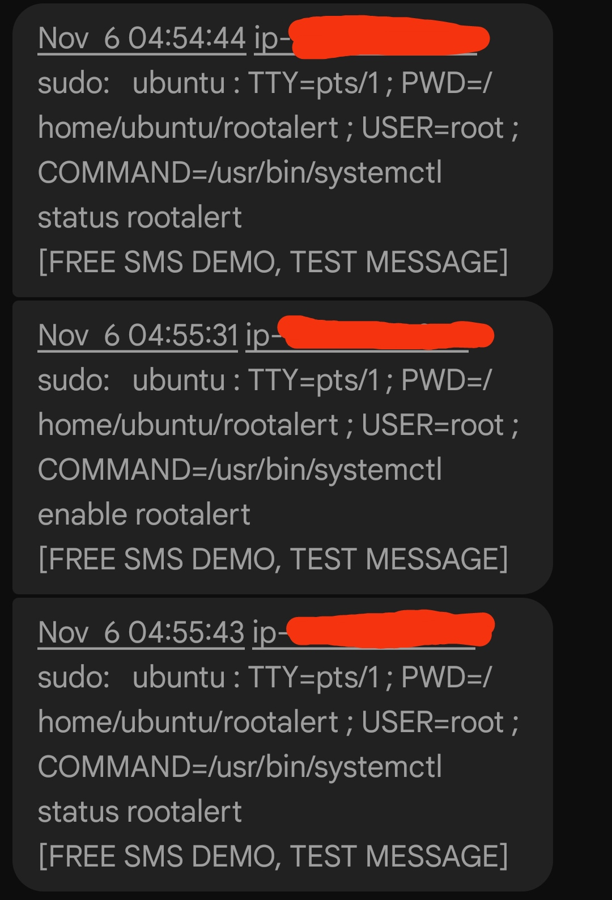

# SSH/ROOT ALERT SCRIPT

The "rootalert folder" contains python script that sends sms alert when a user ssh into this machine or becomes a root user. This project idea and original code is from David. [Github](https://github.com/groovemonkey/sshalert)

## INSTALLATION

## Setup Environment
```
python -m venv venv
venv\Scripts\activate
pip install -r requirements.txt
```

## Run
provision an Amazon EC2 Linux server for this. Keep the project dir in the /root
Using rsync, copy this project directory to your target linux server. 
`rsync -avzhp --exclude rootalert/venv rootalert root@ec2_ip:/root/`
If your are using a Windows OS run, `scp -i imc.pem -r rootalert ubuntu@ec2_ip:/home/ubuntu`
  
## Ubuntu server setup
```
sudo apt-get -y update
sudo apt-get -y upgrade
sudo apt-get -y install virtualenv
virtualenv -p python3 venv
source venv/bin/activate
pip install -r requirements.txt
```

Use the secrets.env(create it here: ***/home/ubuntu/rootalert/secrets.env***) file in the project directory to pass your secrets and reference it in the rootalert.service systemd unit file(create it in this path: ***/etc/systemd/system/rootalert.service***).
```
VONAGE_API_KEY=YOUR_VONAGE_ACC_API_KEY
VONAGE_SECRET=ACCOUNT_API_SECRET
TARGET_PHONE_NUMBER=RECEIVER_PHONE_NUMBER
SOURCE_NUMBER=SOURCE
```

Copy this repo over, adjust paths in ***rootalert.service***
Copy ***rootalert.service*** to /etc/systemd/system/ into whichever target directory you want (probably multi-user)
```
systemctl list-unit-files
systemctl daemon-reload
systemctl start rootalert
systemctl enable rootalert
systemctl stop rootalert
```

